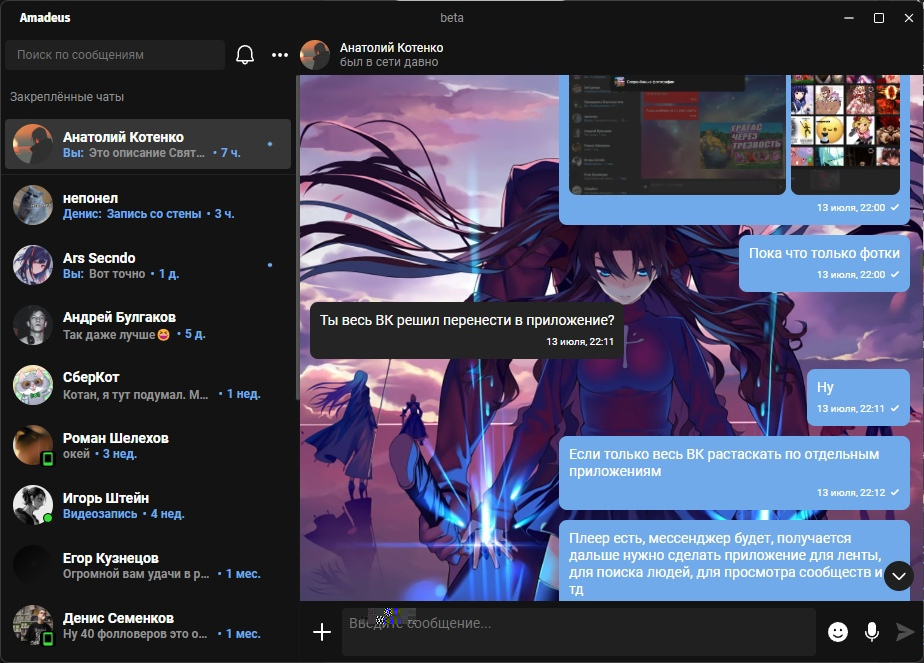

# Amadeus [β]

[![CC BY-NC-SA 4.0][cc-by-nc-sa-shield]][cc-by-nc-sa]

Amadeus - это бесплатный, функциональный мессенджер для VK с открытым исходным кодом.



> Приложение абсолютно бесплатное и не преследует коммерческих целей, **а так же не допускает редактирование кода с целью распространения с любой коммерческой целью.**

> **[β]** Проекту необходимы тестирование и доработка, с дорожной картой проекта, известными багами, а так же узнать, чем можно помочь вы можете во вкладке Projects в репозитории на GitHub.

This work is licensed under a
[Creative Commons Attribution-NonCommercial-ShareAlike 4.0 International License][cc-by-nc-sa].

[![CC BY-NC-SA 4.0][cc-by-nc-sa-image]][cc-by-nc-sa]

[cc-by-nc-sa]: http://creativecommons.org/licenses/by-nc-sa/4.0/
[cc-by-nc-sa-image]: https://licensebuttons.net/l/by-nc-sa/4.0/88x31.png
[cc-by-nc-sa-shield]: https://img.shields.io/badge/License-CC%20BY--NC--SA%204.0-lightgrey.svg

## ⚒️ Development and Build

### Требования перед установкой

* Node.js версии **16.x.x** или выше
* Установщик пакетов yarn

### Сброка приложения

1. Создайте fork этого репозитория
2. Откройте терминал или CLI и впишите эти команды

```bash
git clone https://github.com/<YourNickname>/Amadeus.git
cd amadeus-master
yarn
```

И после этого можно запускать или собирать приложение

```bash
# Run in Dev mode
yarn dev

# Build in Production
yarn global add modclean # Необходимо для уменьшения размера приложения
yarn build # Сборка происходит под ту систему, с которой вы её запускаете
```

### Сборка приложения для Linux под Windows с помощью Docker

Для того, чтобы начать сборку для Linux под Windows, вам необходим установленный и запущенный Docker Desktop в вашей системе. Далее выполняем следующие команды:

```bash
yarn docker # Сборка образа системы для Docker. Достаточно сделать один раз.
yarn build:linux # Сборка приложения в виртуальной машине Docker для Linux
```

## 🖤 Contributing

Любой вклад в работоспособность и функциональность приложения приветствуется. Вы можете свободно открывать Pull Request и предлагать свои наработки. Однако, если собираетесь менять дизайн чего-либо, лучше для начала согласовать это с [разработчиком](529592613).

Поддержать разработку проекта материально можно [здесь](https://donatepay.ru/don/InfiniteHorror).

## ©️ Copyrights

Base, template: [electron-nuxt](https://github.com/michalzaq12/electron-nuxt) by michalzaq12

VK API: [vk-io](https://github.com/negezor/vk-io) by negezor